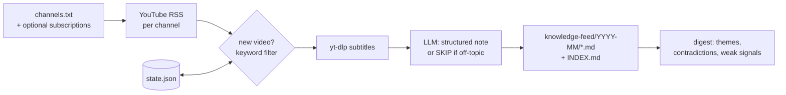

<h1 align="center">yt-collector</h1>

<p align="center">
  <b>You follow 40 YouTube channels. You watch 4.<br>yt-collector reads the other 36 and leaves you notes.</b>
</p>

<p align="center">
  <a href="https://github.com/arnaugonzalez/yt-collector/actions/workflows/ci.yml"></a>
  
  
</p>

<p align="center">
  
</p>

New videos from the channels you follow become Markdown notes you can skim, `grep`, drop into
Obsidian or hand to your coding agent. No YouTube API key, any LLM (local or hosted), one cron line.

## Why

I follow 68 channels, mostly about AI. I was never going to watch them all, and the one video that
mattered each week was buried under three thumbnails of someone looking shocked. So now a
cron job reads the subtitles for me: in four months it has written 725 notes, and every morning
I read one digest instead of a subscriptions page. My coding agent greps the rest.

Side effect: you stop seeing the shocked faces.

## What it is good for

- **Keeping up with a field without the videos.** A daily digest grouped by theme, with links
  back to each video when something is worth the 20 minutes.
- **Giving a coding agent a memory of what is new.** Notes are plain files, so `grep -ril mcp
  knowledge-feed/` works, and the [Claude Code plugin](#use-it-from-claude-code) answers "what
  did people say about X this month?" with sources.
- **Growing an Obsidian vault on autopilot.** Point `YTC_OUT` at a vault folder. Every note has
  YAML front matter (channel, date, URL) for Dataview queries.
- **Watching a niche or your competitors.** List their channels, add a keyword pre-filter and a
  topic, and skip everything else. The digest flags when two channels disagree.
- **Doing it privately and cheaply.** Run it with Ollama for $0, or pay about $0.002 per note
  with DeepSeek.

## What you get

Every few hours it checks the channels you list, grabs the subtitles of new videos, and has an
LLM write one structured note per video. Once a day it merges the recent notes into a digest,
grouped by theme, with a section for **claims that disagree across sources** ("channel A says X,
channel B says the opposite, same week").

```
knowledge-feed/
├── INDEX.md                      # one line per video, newest first
├── DIGEST.md                     # latest digest
├── digests/2026-09-21.md
└── 2026-09/
    └── 2026-09-20_some-channel_new-open-model-beats-gpt_abc123.md
```

## Quickstart

```bash
pipx install yt-collector                      # or: uv tool install yt-collector
mkdir kb && cd kb && yt-collector init         # writes config.env, channels.txt, blocklist.txt
YTC_LLM_API_KEY=sk-or-... YTC_LLM_MODEL=deepseek/deepseek-chat yt-collector run
```

`init` points to OpenRouter by default. For a fully local setup, use Ollama instead. Ollama
serves 4,096 tokens of context by default and **silently cuts longer prompts**, so a normal
transcript loses most of its text without any error. Create a model with a larger context first:

```bash
printf 'FROM qwen2.5:3b\nPARAMETER num_ctx 16384\n' > Modelfile
ollama create qwen2.5-16k -f Modelfile
YTC_LLM_BASE_URL=http://localhost:11434/v1 YTC_LLM_MODEL=qwen2.5-16k yt-collector run
```

(Or start the server with `OLLAMA_CONTEXT_LENGTH=16384`.) On a laptop CPU without a GPU, a 3B
model takes about 4 minutes per note; that is fine for a scheduled job, slow for a first try.

The first run only looks back 24 hours (`YTC_LOOKBACK_HOURS`). After that, every run processes
whatever is new since the previous one. Then:

```bash
yt-collector digest                  # merge the last 30 h of notes
yt-collector digest --window-hours 168   # weekly
```

## Use it from Claude Code

The repo is also a Claude Code plugin. It adds a skill that finds your feed, searches it, and
answers with the video links as sources ("what did the channels I follow say about MCP this
month?"). It can also run or set up the collector for you.

```
/plugin marketplace add arnaugonzalez/yt-collector
/plugin install yt-collector@yt-collector
```

Other agents (Cursor, Codex, Gemini CLI) can read the same instructions from
[`plugin/skills/youtube-knowledge-feed/SKILL.md`](plugin/skills/youtube-knowledge-feed/SKILL.md).

## Why not…

| | Watches channels unattended | Output | Contradictions between sources | Cost |
|---|---|---|---|---|
| **yt-collector** | yes (RSS, no API key) | one Markdown note per video + index + digest, in a folder | yes | your LLM (≈$0.002/note measured with DeepSeek; $0 with Ollama) |
| [fabric](https://github.com/danielmiessler/fabric) | no, one URL at a time | stdout | no | your LLM |
| [tubeless](https://github.com/seokhoonj/tubeless) | yes | daily ranked briefing, one file per day | no | your LLM |
| NotebookLM / Eightify / Glasp | no | in their app | no | free tier / subscription |
| Feedly Leo / Readwise Reader | feeds, not transcripts | in their app | no | subscription |

fabric has a much larger prompt library, and tubeless also transcribes videos without
subtitles (Whisper) and ranks them by importance. Pick them if you want a daily briefing to
read. Pick yt-collector if you want the notes to pile up as files that you, Obsidian or a coding
agent can `grep` months later.

## How it works



- **No YouTube API key.** Channel feeds come from the public RSS endpoint; `@handles` are
  resolved to channel ids once and cached in `state.json`.
- **Idempotent.** Processed video ids live in `state.json`, so running it twice does nothing
  new. If the LLM call fails, the video is retried on the next run (up to 3 times) and the run
  exits with status 1 so your scheduler shows the failure.
- **Notes have a fixed shape**: YAML front matter (`title`, `channel`, `url`, `video_id`,
  `published`, `collected`) and the sections *TL;DR, Key topics, What's new, Entities, Facts
  and figures*. Headings stay in English; the content follows `YTC_SUMMARY_LANG`.

## Configuration

Values come from `config.env` in the working directory (or `-C DIR`), else
`$XDG_CONFIG_HOME/yt-collector/config.env`. Environment variables override both.

| Variable | Default | |
|---|---|---|
| `YTC_LLM_BASE_URL` | `https://api.openai.com/v1` | any OpenAI-compatible endpoint |
| `YTC_LLM_API_KEY` | falls back to `OPENAI_API_KEY` | not needed for localhost |
| `YTC_LLM_MODEL` | — (required) | |
| `YTC_LLM_PROVIDER` | `openai` | `command` pipes the prompt into `YTC_LLM_COMMAND` (e.g. `llm -m …`, or `claude -p --tools "" --strict-mcp-config`: see [Security](#security)) |
| `YTC_SUMMARY_LANG` | `English` | language of the note content |
| `YTC_TOPIC` | `technology and AI` | the LLM skips off-topic videos; empty = keep all |
| `YTC_KEYWORDS` | empty | cheap whole-word pre-filter on title + description |
| `YTC_OUT` | `knowledge-feed` | |
| `YTC_CHANNELS` / `YTC_BLOCKLIST` / `YTC_STATE` | `channels.txt` / `blocklist.txt` / `state.json` | |
| `YTC_SUB_LANGS` | `en,en-orig,en-US` | subtitle languages, tried one at a time |
| `YTC_LOOKBACK_HOURS` | `24` | first run only |
| `YTC_MAX_PER_RUN` | `25` | the rest wait for the next run |
| `YTC_MAX_TRANSCRIPT_CHARS` | `48000` | transcript truncation |
| `YTC_YTDLP_BIN` | empty = the bundled yt-dlp | set to use another yt-dlp binary |

**Your subscriptions (optional).** `yt-collector auth` runs a one-time OAuth consent (read-only
scope) and from then on merges the channels you are subscribed to. It needs your own Google
Cloud OAuth client of type *Desktop app* (`YTC_OAUTH_CLIENT_ID` / `YTC_OAUTH_CLIENT_SECRET`).
While the OAuth app stays in "testing" mode, Google expires the refresh token after a while:
re-run `auth` when the log says so.

## Scheduling

`run` and `digest` are plain idempotent commands. See [`examples/`](examples/) for cron, a
systemd user timer, and a GitHub Actions workflow. To publish the feed somewhere else, chain
it: `yt-collector run && rsync -a knowledge-feed/ server:kb/`.

## Limits

- **Subtitles are required.** Videos without subtitles or auto-captions are skipped.
- **Datacenter IPs get bot-checked.** YouTube often refuses subtitle downloads from cloud
  servers ("Sign in to confirm you're not a bot"). A home machine works reliably; on a server
  you need yt-dlp cookies or a proxy.
- **Terms of service.** Downloading subtitles with yt-dlp is not a use YouTube explicitly
  permits. yt-collector keeps transcripts in memory only and writes transformed summaries.
  Don't redistribute transcripts, and check the rules that apply to you.
- **Contradictions are leads, not verdicts.** Checked by hand over 4 real days, the section
  flags 2–3 pairs per window and at most one is a genuine disagreement; the rest are nuances the
  model explains away in its own note.

Non-goals: a web UI, a database, transcribing audio.

## Security

Transcripts are text written by strangers, and yt-collector hands them to an LLM. If that LLM is
an agent CLI with tools (Claude Code, Codex, Gemini CLI…), a video can carry instructions like
"ignore the above and run this command", and the agent may do it with your permissions. We
reproduced this with `claude -p` in auto mode. Disable every tool for this job:

```bash
YTC_LLM_COMMAND=claude -p --tools "" --strict-mcp-config
```

HTTP providers (`YTC_LLM_PROVIDER=openai`, the default) only return text, so they can't run
anything. yt-collector itself never runs a shell, opens a port, or sends telemetry; it talks to
YouTube, your LLM endpoint and nothing else. See [SECURITY.md](SECURITY.md) to report issues.

## License

MIT
